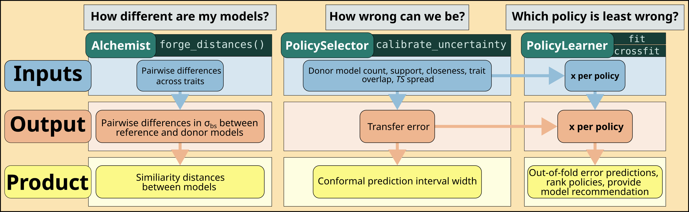

```{r, include = FALSE}
knitr::opts_chunk$set(collapse = TRUE, comment = "#>", eval = FALSE)

`%||%` <- function(x, y) {
  if (is.null(x)) y else x
}

code_drop <- function(id, yaml, r, title = "Default configuration") {
  esc <- function(x) {
    x <- gsub("&", "&amp;", x, fixed = TRUE)
    x <- gsub("<", "&lt;", x, fixed = TRUE)
    gsub(">", "&gt;", x, fixed = TRUE)
  }
  knitr::asis_output(paste0(
    '<details class="code-drop">',
    "\n<summary>&#128187; ", esc(title), "</summary>\n\n",
    "::: {.panel-tabset}\n\n",
    "### YAML\n\n",
    "```yaml\n", yaml, "\n```\n\n",
    "### R list\n\n",
    "```r\n", r, "\n```\n\n",
    ":::\n\n",
    "</details>"
  ))
}

code_only_drop <- function(id, code, title = "Code", language = "r") {
  esc <- function(x) {
    x <- gsub("&", "&amp;", x, fixed = TRUE)
    x <- gsub("<", "&lt;", x, fixed = TRUE)
    gsub(">", "&gt;", x, fixed = TRUE)
  }
  knitr::asis_output(paste0(
    '<details class="code-drop">',
    "\n<summary>&#128187; ", esc(title), "</summary>\n\n",
    "```", language, "\n", code, "\n```\n\n",
    "</details>"
  ))
}

method_default_registry <- local({
  paths <- c(
    system.file("learner_method_defaults.json", package = "tsbiomass"),
    file.path("..", "inst", "learner_method_defaults.json"),
    file.path("inst", "learner_method_defaults.json")
  )
  path <- paths[nzchar(paths) & file.exists(paths)][[1]]
  jsonlite::read_json(path, simplifyVector = FALSE)
})

method_family <- function(method) {
  switch(method,
    glm = "glm",
    glm_ridge = "glm_penalized",
    glm_lasso = "glm_penalized",
    glm_elastic = "glm_penalized",
    qreg = "qreg",
    gam = "gam",
    lmm = "lmm",
    rpart = "rpart",
    rf = "rf",
    xgboost = "xgboost",
    mars = "mars",
    bart = "bart",
    xbart = "bart",
    wsbart = "bart",
    vfbart = "bart",
    rebart = "bart",
    knn = "knn",
    cubist = "cubist",
    svr = "svr",
    qrf = "qrf",
    gpr = "gpr",
    mean = "mean",
    super_learner = "super_learner",
    stop(sprintf("No method default family defined for '%s'.", method), call. = FALSE)
  )
}

method_default_arguments <- function(method) {
  if (identical(method, "super_learner")) {
    return(list(
      super_methods = NULL,
      inner_folds = 5L,
      metalearner_loss = "squared_error"
    ))
  }
  family <- method_family(method)
  args <- method_default_registry$families[[family]] %||% list()
  method_args <- method_default_registry$methods[[method]] %||% list()
  modifyList(args, method_args)
}

format_yaml_value <- function(x) {
  if (is.null(x)) {
    "null"
  } else if (isTRUE(x)) {
    "true"
  } else if (identical(x, FALSE)) {
    "false"
  } else if (is.numeric(x)) {
    as.character(x)
  } else {
    as.character(x)
  }
}

format_r_value <- function(x) {
  if (is.null(x)) {
    "NULL"
  } else if (isTRUE(x)) {
    "TRUE"
  } else if (identical(x, FALSE)) {
    "FALSE"
  } else if (is.numeric(x)) {
    as.character(x)
  } else {
    sprintf("%s", deparse(x))
  }
}

method_default_yaml <- function(method) {
  args <- method_default_arguments(method)
  if (identical(method, "super_learner")) {
    return(paste(
      sprintf("method: %s", method),
      sprintf("super_methods: %s", format_yaml_value(args$super_methods)),
      sprintf("inner_folds: %s", format_yaml_value(args$inner_folds)),
      sprintf("metalearner_loss: %s", format_yaml_value(args$metalearner_loss)),
      sep = "\n"
    ))
  }
  lines <- c(sprintf("method: %s", method), "method_settings:")
  if (length(args) == 0L) {
    lines <- c(lines, sprintf("  %s: {}", method))
  } else {
    lines <- c(
      lines,
      sprintf("  %s:", method),
      sprintf("    %s: %s", names(args), vapply(args, format_yaml_value, character(1)))
    )
  }
  paste(lines, collapse = "\n")
}

method_default_r <- function(method) {
  args <- method_default_arguments(method)
  if (identical(method, "super_learner")) {
    return(sprintf(
      'list(\n  method = "%s",\n  super_methods = %s,\n  inner_folds = %s,\n  metalearner_loss = %s\n)',
      method,
      format_r_value(args$super_methods),
      format_r_value(args$inner_folds),
      format_r_value(args$metalearner_loss)
    ))
  }
  if (length(args) == 0L) {
    return(sprintf('list(\n  method = "%s",\n  method_settings = list(\n    %s = list()\n  )\n)', method, method))
  }
  arg_lines <- sprintf("      %s = %s", names(args), vapply(args, format_r_value, character(1)))
  arg_lines <- paste(arg_lines, collapse = ",\n")
  sprintf('list(\n  method = "%s",\n  method_settings = list(\n    %s = list(\n%s\n    )\n  )\n)', method, method, arg_lines)
}

method_default_drop <- function(id, method) {
  code_drop(
    id = id,
    yaml = method_default_yaml(method),
    r = method_default_r(method),
    title = sprintf("Default configuration for %s", method)
  )
}
```

`tsbiomass` uses a Super Learner (stacked ensemble) in three distinct places.
Each learner has a different outcome, a different feature set, and different
practical constraints. Understanding which learner is which, and what it is
actually predicting, is the most important thing before you start tuning.

```{r list-learners-example, echo=FALSE, results='asis', eval=TRUE}
code_only_drop(
  id = "list-learners-example",
  title = "List available learner methods",
  language = "r",
  code = paste(
    "library(tsbiomass)",
    "",
    "# See what method names are valid in any context",
    "list_learners()",
    sep = "\n"
  )
)
```

Each learner section below includes a collapsible table of its valid methods.
The Alchemist accepts a restricted set. The Uncertainty and Selection learners
accept the full catalog.

---

## The Super Learners

{width=809.8086, height=250} 

---

## Similarity distances

**What it learns.** Given a table of per-trait pairwise distances (one per donor-anchor pair), it predicts the absolute log-ratio of the donor's expected $\sigma_\mathrm{bs}$ to the anchor's $\sigma_\mathrm{bs}$, integrated over the anchor's length distribution. The resulting $N\ \times N$ distance matrix is the backbone of all downstream similarity weighting, ordination, and admissibility scoring.

<details>
<summary>
<strong>Available methods</strong>
</summary>

<details>
<summary>
(Penalized) linear
</summary>

| Method | Arg. | Strengths | Weaknesses |
| ------ | ---- | --------- | ---------- |
| Generalized linear model | `glm` | The linear component of trait distance predicting differences in $\sigma_\mathrm{bs}$ is real. Plain OLS almost always receives meaningful NNLS weight. Coefficients show which trait dimensions matter most and are therefore interpretable. Fast. | Cannot capture nonlinear or interaction effects. If the difference in $\sigma_\mathrm{bs}$ is driven by threshold crossings rather than distance magnitude, GLM will be consistently biased toward the mean. |
| L2 regularization | `glm_ridge` | Handles multicollinearity between traits (e.g., genus and family). Trait distances move together by construction, and ridge shrinks them proportionally rather than picking one arbitrarily. Stable when feature count approaches pair count. | Does not zero out irrelevant features. No advantage over Elastic-net when sparsity is desired. Rarely competitive as the sole penalized choice.|
| L1 regularization |`glm_lasso` | Produces a sparse model identifying a few trait dimensions that actually drive $\sigma_\mathrm{bs}$ divergence. Useful for diagnosing whether a small subset of traits dominates the trait distances. | Unstable when features are highly correlated because LASSO can arbitrarily choose among correlated traits. |
| Elastic-net | `glm_elastic` | Combines the collinearity handling from ridge regressions with LASSO's feature selection. The recommended default penalized choice for this context. Stable coefficient paths. Robust to overfitting on pairwise training data. | The $\alpha$ hyperparameter must be chosen before fitting. Ridge-leaning values stabilize correlated traits, while larger values select more aggressively when many features are genuinely irrelevant. |

</details>

<details>
<summary>
Smooth and piecewise
</summary>

| Method | Arg. | Strengths | Weaknesses |
| ------ | ---- | --------- | ---------- |
| Generalized additive models | `gam` | Captures smooth nonlinear relationships between individual trait distances. Each trait gets its own smooth term, so the shape of each dimension's contribution is interpretable. Well-calibrated on medium-size pair tables.  | Assumes independence of trait contibutions with no $\text{trait} \times \text{trait}$ interactions in the default setup. If differences in $\sigma_\mathrm{bs}$ is driven by joint combinations of traits, the GAM will miss them entirely.  |
| Multivariate adaptive regression splines | `mars` | Detects sharp transitions in the trait distances (e.g., taxonomic divides). Handles threshold structure without requiring f ull interaction modeling. Faster than `rf` and `xgboost` on small pair tables. | With interaction hinge terms (`degree = 2`) the model can overfit in small pair tables. The backward pruning pass needs appropriate penalty tuning. Interpretation requires inspecting hinge knot positions. |

</details>

<details>
<summary>
Tree-based
</summary>

| Method | Arg. | Strengths | Weaknesses |
| ------ | ---- | --------- | ---------- |
| Random forest | `rf` | Captures nonlinear interactions between multiple ttrait dimensions. Robust to irrelevant or redundant features. Strong default across a wide range of pair counts. | Memory-intensive when the pair tabel is large. Requires enough pairs per fold for reliable OOB error estimation. Sensitive to the minimum number of training observations allowed and decision trees. | |
| eXtreme Gradient Boosting | `xgboost` | Highest capcity for capturing higher-order interactions between trait features. Each tree corrects residuals of the previous, allowing precise modeling of complex interactions. Best when many traits interact non-additively. | Needs sufficient pair counts to regularize effectively. In small candidate pools the pair count is too low and overfitting is severe. More hyperparameters to tune than `rf`. |
| Recursive partitioning and regression trees | `rpart` | Produces an explicitly interpretable decision tree that is computationally fast. When NNLS assigns `rpart` a substantial weight, this serves as a diagnostic that indicates the trait distances have hard thresholds that all continuous models are smoothing over. | Almost always dominated by `rf` or `mars` in an ensemble. Single tree has high variance across folds. Not competitive as a standalone predictor. |

::: {.tip data-title="Feature type matters"}
Before tuning the learner library, check `feature_type`. The default
`feature_type = "gower"` is unsigned, which means nonlinear methods like `rf`
and `xgboost` must discover asymmetries themselves. Switching to
`feature_type = "difference"` encodes direction explicitly and often improves
RF and XGBoost generalization without any other change.
:::
</details>

<details>
<summary>
Conditional quantile
</summary>

| Method | Arg. | Strengths | Weaknesses |
| ------ | ---- | --------- | ---------- |
| Quantile regression | `qreg` | Models a conditional quantile of distance rather than the mean. At $\tau > 0.5$ it targets the tail-ends (pessimistic) of the distance distribution. Useful when some trait combinations produce high-variance $\sigma_\mathrm{bs}$ outcomes and one wants the ensemble to account for the tail. | Linear quantile regression shares GLM's inability to capture nonlinear effects. Numerically unstable with very few pairs. The $\tau$ parameter must be chosen deliberately: median targets central distance, while upper quantiles target pessimistic distance. | 
</details>

</details>

**Recommended default**

```{r default-config-alchemist, echo=FALSE, results='asis', eval=TRUE}
code_drop(
  id = "default-config-alchemist",
  title = "Default Alchemist learner configuration",
  yaml = paste(
    "alchemist:",
    "  learner:",
    "    methods: [glm_elastic, rf, xgboost]",
    "    inner_folds: 5",
    "    outcome_transform: log1p",
    "    lambda_rule: lambda.1se",
    sep = "\n"
  ),
  r = paste(
    "list(",
    "  alchemist = list(",
    "    learner = list(",
    '      methods = c("glm_elastic", "rf", "xgboost"),',
    "      inner_folds = 5,",
    '      outcome_transform = "log1p",',
    '      lambda_rule = "lambda.1se"',
    "    )",
    "  )",
    ")",
    sep = "\n"
  )
)
```

The default three-method ensemble balances regularized linearity (`glm_elastic`),
nonlinear main effects (`rf`), and interaction capture (`xgboost`). The NNLS
combiner then determines how much weight each method gets per fold.

::: {.tip data-title="Taxonomic distances"}
If your candidate pool has good phylogenetic coverage, setting
`taxonomic_distance = TRUE` replaces the separate species, genus, family, etc.,
traits with a single continuous distance from the Open Tree of Life. This
reduces feature collinearity and tends to improve out-of-fold accuracy for
methods with limited regularization (e.g., `gam`, `rpart`).
:::

**Growing or shrinking the library**

The Alchemist is always a stacked ensemble: the `methods:` list *is* the library, and the NNLS combiner reweights it per fold. There is no separate `super_learner` switch here (that toggle exists only for the Uncertainty and Selection learners). Expand the library (add `mars`, `gam`, `rpart`, or a tail-targeting `qreg`) when the pair table is large and you suspect threshold or tail structure the default three miss. Shrink toward `[glm_elastic, rf]` when the candidate pool is small, since few models means few pairs and the richer learners overfit.

<details>
<summary>
<strong>Method notes</strong>
</summary>

<details>
<summary>
<code>glm</code>
</summary>

Unpenalized OLS. No hyperparameters. The fast linear reference member of the library.

This entry is intentionally kept as a low-variance baseline so the NNLS combiner always has a stable linear option when nonlinear learners become noisy on small pair tables. If `glm` receives non-trivial weight, the data are telling you that most transferable signal is linear in trait distance and additional nonlinear capacity is incremental rather than foundational.

```{r defaults-method-glm-01, echo=FALSE, results='asis', eval=TRUE}
method_default_drop("method-glm-01", "glm")
```

</details>

<details>
<summary>
<code>glm_ridge</code>
</summary>

`glmnet` with `alpha = 0` (pure L2). `lambda` is chosen by inner cross-validation (`lambda_rule`). Features are standardized and the CV loss is MAE.

Ridge is here to stabilize coefficients under collinear trait distances. `alpha = 0` avoids brittle feature dropping and instead shrinks correlated predictors together. `lambda_rule` controls conservatism (`lambda.1se` for stability, `lambda.min` for fit), while standardization ensures penalty comparability across mixed feature scales.

```{r defaults-method-glm-ridge-01, echo=FALSE, results='asis', eval=TRUE}
method_default_drop("method-glm-ridge-01", "glm_ridge")
```

</details>

<details>
<summary>
<code>glm_lasso</code>
</summary>

`glmnet` with `alpha = 1` (pure L1). `lambda` by inner CV.

This is primarily a sparsity diagnostic in Alchemist: it can reveal which trait-distance axes dominate, but fold-to-fold stability is weaker when predictors are correlated. `lambda` tuning is therefore more about controlling instability than maximizing fit, and production libraries usually prefer elastic-net unless hard sparsity is explicitly needed.

```{r defaults-method-glm-lasso-01, echo=FALSE, results='asis', eval=TRUE}
method_default_drop("method-glm-lasso-01", "glm_lasso")
```

::: {.caution data-title="Correlated traits"}
`glm_lasso` can select one trait distance from a correlated group and drop the
others even when the whole group carries the signal. In an `Alchemist` object,
trait distances are correlated by construction, so `glm_lasso` is most useful as
a sparsity diagnostic. Prefer `glm_elastic` for production fits because it keeps
the stabilizing shrinkage from ridge while still allowing weak feature
selection.
:::

</details>

<details>
<summary>
<code>glm_elastic</code>
</summary>

[`glmnet`](https://CRAN.R-project.org/package=glmnet) elastic-net regression contributes a shrinkage-stabilized linear member. `alpha` controls the ridge-to-lasso mix: lower values keep correlated trait distances together, while higher values make the fit sparser. `lambda_rule` controls how conservative the inner cross-validation penalty is.

This is the default penalized linear choice because Alchemist tables are usually both noisy and collinear. A ridge-leaning `alpha` preserves grouped information from related distances, and `lambda_rule` provides the final bias-variance dial for pair-table size and feature breadth.

```{r defaults-method-glm-elastic-01, echo=FALSE, results='asis', eval=TRUE}
method_default_drop("method-glm-elastic-01", "glm_elastic")
```

::: {.caution data-title="High-dimensional trait expansions"}
In very high-dimensional feature spaces (many trait expansions,
`feature_type = "difference"` with set-type traits), `lambda_rule = "lambda.min"`
may overfit the training pairs. Prefer `lambda.1se` for this learner unless you
have a large candidate pool and Sentinel validates the more aggressive fit.

```{r code-drop-cfg-alchemist-elastic, echo=FALSE, results='asis', eval=TRUE}
code_drop(
  id = "cfg-alchemist-elastic",
  title = "Elastic-net emphasis",
  yaml = paste(
    "alchemist:",
    "  learner:",
    "    methods: [glm_elastic]",
    "    lambda_rule: lambda.1se",
    "    method_settings:",
    "      glm_elastic:",
    "        alpha: 0.25",
    "        standardize: true",
    "        type_measure: mae",
    sep = "\n"
  ),
  r = paste(
    "list(",
    "  alchemist = list(",
    "    learner = list(",
    "      methods = \"glm_elastic\",",
    "      lambda_rule = \"lambda.1se\",",
    "      method_settings = list(",
    "        glm_elastic = list(",
    "          alpha = 0.25,",
    "          standardize = TRUE,",
    "          type_measure = \"mae\"",
    "        )",
    "      )",
    "    )",
    "  )",
    ")",
    sep = "\n"
  )
)
```
:::

</details>

<details>
<summary>
<code>gam</code>
</summary>

`mgcv`, one smooth term per feature. Fitted with `fit_method = "REML"` and `select_terms = TRUE`, so the extra penalty can shrink an uninformative smooth to zero. Benefits from `taxonomic_distance = TRUE`, which cuts feature collinearity.

The default GAM settings are chosen to capture smooth nonlinear main effects without opening a large interaction search space. `fit_method = "REML"` gives more stable smoothness selection on moderate data, and `select_terms = TRUE` prevents weak smooth terms from lingering as noise absorbers.

```{r defaults-method-gam-01, echo=FALSE, results='asis', eval=TRUE}
method_default_drop("method-gam-01", "gam")
```

</details>

<details>
<summary>
<code>mars</code>
</summary>

[`earth`](https://CRAN.R-project.org/package=earth) MARS contributes piecewise-linear hinge functions. `degree` controls whether hinges are additive or include interactions, `penalty` controls the GCV complexity cost, `pmethod` chooses the pruning strategy, and `nprune` can cap the retained terms when the automatic pruning path is too permissive.

MARS is the threshold-sensitive member in this library. `degree` is the primary complexity lever, `penalty` and `pmethod` shape how aggressively candidate hinges are removed, and `nprune` is a practical safeguard when pair counts are too small to justify long hinge paths. `nk` and `fast_k` bound the forward pass rather than the pruned result: `nk` caps how many terms may be built before pruning begins, and `fast_k` caps the queue of parent terms considered at each step. Both default to unset, letting `earth` size the search from the feature count (`nk` resolves to `min(200, max(20, 2 * ncol(x))) + 1`, `fast_k` to 20). Because the forward pass dominates MARS runtime and grows with the feature set, `nk` is the effective cost lever once `degree` allows interactions. Choose it against evidence rather than by feel: fit once, inspect how many terms the backward pass actually retains, and set `nk` comfortably above that. A cap the pruner is pressing against is suppressing real structure, not saving time.

```{r defaults-method-mars-01, echo=FALSE, results='asis', eval=TRUE}
method_default_drop("method-mars-01", "mars")
```

</details>

<details>
<summary>
<code>rpart</code>
</summary>

[`rpart`](https://CRAN.R-project.org/package=rpart) contributes a single interpretable tree. `cp` controls cost-complexity pruning, `minsplit` and `minbucket` control how much data must support a split or terminal node, and `maxdepth` caps tree depth. Substantial NNLS weight flags hard thresholds in the distance surface.

`xval`, `maxcompete`, and `maxsurrogate` all default to 0, which departs from `rpart`'s own defaults of 10, 4, and 5. Nothing here consumes their output: `cp` is configured directly rather than read off a cross-validated cost-complexity table, and the design matrix is complete, so surrogate splits never fire. Leaving `rpart`'s defaults in place would spend roughly ten internal cross-validations per fit building a table nothing reads. Raise `xval` if you want the cptable for manual inspection and accept the cost.

Treat this as an interpretability and structure-detection member, not a pure accuracy engine. If `rpart` receives real ensemble weight, it usually indicates a genuine rule boundary in trait-distance space that smoother models are averaging away.

```{r defaults-method-rpart-01, echo=FALSE, results='asis', eval=TRUE}
method_default_drop("method-rpart-01", "rpart")
```

</details>

<details>
<summary>
<code>rf</code>
</summary>

[`ranger`](https://CRAN.R-project.org/package=ranger) contributes nonlinear interactions without specifying them up front. `num_trees` controls ensemble size, `mtry` controls feature subsampling at each split, `min_node_size` and `max_depth` control tree complexity, and `sample_fraction`/`replace` control row sampling.

```{r defaults-method-rf-01, echo=FALSE, results='asis', eval=TRUE}
method_default_drop("method-rf-01", "rf")
```

::: {.caution data-title="Large pair tables"}
Random forests are memory-intensive when the donor-anchor pair table is large.
If memory is tight, reduce `num_trees` to 200-300 before reducing
`sample_fraction`; fewer trees usually cost less accuracy than starving every
tree of rows.

```{r code-drop-cfg-alchemist-rf-memory, echo=FALSE, results='asis', eval=TRUE}
code_drop(
  id = "cfg-alchemist-rf-memory",
  title = "Random forest, memory-constrained",
  yaml = paste(
    "alchemist:",
    "  learner:",
    "    method_settings:",
    "      rf:",
    "        num_trees: 300",
    "        min_node_size: 10",
    "        sample_fraction: 0.6",
    "        replace: false",
    sep = "\n"
  ),
  r = paste(
    "list(",
    "  alchemist = list(",
    "    learner = list(",
    "      method_settings = list(",
    "        rf = list(",
    "          num_trees = 300,",
    "          min_node_size = 10,",
    "          sample_fraction = 0.6,",
    "          replace = FALSE",
    "        )",
    "      )",
    "    )",
    "  )",
    ")",
    sep = "\n"
  )
)
```
:::

</details>

<details>
<summary>
<code>xgboost</code>
</summary>

[`xgboost`](https://CRAN.R-project.org/package=xgboost) contributes boosted interaction structure. `nrounds` and `eta` control the boosting path, `max_depth` and `min_child_weight` control tree complexity, and `lambda`/`alpha` add regularization. Small pair tables need conservative values because boosting can memorize sparse donor-anchor patterns.

`early_stopping_rounds` is unset by default, which runs the full `nrounds` schedule exactly as configured. Setting it turns `nrounds` into a ceiling: the fit holds out `validation_fraction` (0.2 by default) to find the round at which held-out error stops improving, then refits on the complete training data at that count. The refit is essential rather than cosmetic, because on small pair tables the data surrendered to the held-out share costs more than the stopping recovers. With it in place, a lower `eta` becomes the better setting, since the round count is discovered rather than guessed.

```{r defaults-method-xgboost-01, echo=FALSE, results='asis', eval=TRUE}
method_default_drop("method-xgboost-01", "xgboost")
```

::: {.caution data-title="Small candidate pools"}
In small candidate pools (N < 50 models), boosted trees can memorize sparse
donor-anchor patterns. Keep `xgboost` shallow and slow-learning unless Sentinel
shows that a higher-capacity fit improves holdout error.

```{r code-drop-cfg-alchemist-small-pool, echo=FALSE, results='asis', eval=TRUE}
code_drop(
  id = "cfg-alchemist-small-pool",
  title = "XGBoost for a small candidate pool",
  yaml = paste(
    "alchemist:",
    "  learner:",
    "    methods: [xgboost]",
    "    method_settings:",
    "      xgboost:",
    "        nrounds: 200",
    "        eta: 0.05",
    "        max_depth: 3",
    "        min_child_weight: 5",
    "        subsample: 0.8",
    "        colsample_bytree: 0.8",
    "        lambda: 2",
    "        alpha: 0.5",
    sep = "\n"
  ),
  r = paste(
    "list(",
    "  alchemist = list(",
    "    learner = list(",
    "      methods = \"xgboost\",",
    "      method_settings = list(",
    "        xgboost = list(",
    "          nrounds = 200,",
    "          eta = 0.05,",
    "          max_depth = 3,",
    "          min_child_weight = 5,",
    "          subsample = 0.8,",
    "          colsample_bytree = 0.8,",
    "          lambda = 2,",
    "          alpha = 0.5",
    "        )",
    "      )",
    "    )",
    "  )",
    ")",
    sep = "\n"
  )
)
```
:::

</details>

<details>
<summary>
<code>qreg</code>
</summary>

[`quantreg`](https://CRAN.R-project.org/package=quantreg) contributes a linear conditional quantile rather than a conditional mean. `tau` chooses which quantile is fitted: values above 0.5 make the learner target pessimistic upper-tail distances, while 0.5 is median regression. `fit_method` selects the quantile-regression solver.

Use this when you need explicit tail sensitivity in distance prediction. `tau` is the risk dial: higher values emphasize worst-case transfer regions, while lower values track central behavior. Solver choice is worth documenting in reproducible workflows because near-singular pair tables can be method-sensitive.

```{r defaults-method-qreg-01, echo=FALSE, results='asis', eval=TRUE}
method_default_drop("method-qreg-01", "qreg")
```

::: {.danger data-title="Small pair tables"}
Quantile regression is numerically unstable with very few pairs. Use `qreg` only
when the pair table is large enough to support a tail fit and you actually need
a pessimistic distance learner. If the pair table is small, this is not a tuning
problem; remove `qreg` from the Alchemist library.
:::

</details>

</details>

---

## Uncertainty and conformal prediction

**What it learns.** Cross-fitted regression that predicts the expected absolute
log-transfer-error for each anchor policy combination. The fitted predictions
are used to calibrate conformal prediction intervals: once you know where the
error tends to be large, the intervals can be widened there and tightened
elsewhere.

<details>
<summary>
<strong>Available methods</strong>
</summary>

<details>
<summary>
(Penalized) linear
</summary>

| Method | Arg. | Strengths | Weaknesses |
| ------ | ---- | --------- | ---------- |
| Generalized linear model | `glm` | Linear baseline for error prediction. Often earns real NNLS weight because error scales with features like support size or nearest-anchor distance. Anchors the ensemble and is interpretable. | Cannot capture nonlinear or threshold effects. If error spikes sharply beyond a similarity threshold, GLM underestimates the high-error region and produces under-wide intervals there. |
| Ridge (L2) regression | `glm_ridge` | Handles correlated benchmark statistics. Policy score and interval width move together, and ridge shrinks them proportionally rather than picking one. Stable when the benchmark feature table has many columns. | Does not zero out uninformative features. Marginal benefit over `glm_elastic` in most settings. Not recommended as the sole penalized member. |
| LASSO (L1) regression | `glm_lasso` | Selects the few benchmark features most predictive of error magnitude. Useful for trimming a large benchmark feature table and for seeing which covariates actually drive error. | Unstable when features are correlated. LASSO picks arbitrarily among correlated columns. In practice `glm_elastic` is almost always preferred. |
| Elastic-net | `glm_elastic` | Balances selection and shrinkage when benchmark features are numerous and correlated. Works well with `lambda.min` here because the downstream conformal calibration adds regularization. | Requires `alpha` and `lambda` tuning. Ridge-leaning values stabilize correlated benchmark features, while larger values select more aggressively in high-dimensional tables. |

</details>

<details>
<summary>
Smooth and piecewise
</summary>

| Method | Arg. | Strengths | Weaknesses |
| ------ | ---- | --------- | ---------- |
| Generalized additive models | `gam` | Captures smooth nonlinear error-covariate relationships, such as error accelerating as support distance increases. Each benchmark feature gets its own smooth term, so each contribution is interpretable. Well-calibrated on medium-size tables. | Assumes additive, independent contributions from each benchmark feature. If error is driven by interactions (low support and poor frequency match together), the GAM misses them entirely. |
| Multivariate adaptive regression splines | `mars` | Models threshold behavior in error, e.g. error spiking once the nearest anchor falls outside a similarity radius. Handles discontinuities that GAM and GLM smooth over. Faster than `rf` on small benchmark tables. | With interaction hinge terms (`degree = 2`) and many features it can overfit small benchmark tables. The backward pruning pass needs tuning to avoid retaining spurious terms. |

</details>

<details>
<summary>
Tree-based
</summary>

| Method | Arg. | Strengths | Weaknesses |
| ------ | ---- | --------- | ---------- |
| Random forest | `rf` | Captures nonlinear interactions between benchmark features and error magnitude (high error only when both support is low and frequency match is poor). Robust to irrelevant features. Recommended in nearly every uncertainty ensemble. | Mean-regression forest targets the expected error, not the upper tail that determines interval width. Always pair `rf` with `qreg` or `qrf`, which directly target the tail. |
| eXtreme Gradient Boosting | `xgboost` | Higher-capacity interaction learning for error prediction. Sequential boosting corrects residuals left by simpler models. Strong when the benchmark training set is large. | Small anchor-policy training sets are the norm. Without conservative settings (`eta ≤ 0.05`, `min_child_weight ≥ 5`) XGBoost overfits the benchmark table severely. |
| Recursive partitioning and regression trees | `rpart` | Produces an interpretable stratification of error by benchmark strata. Fast. Meaningful NNLS weight signals that error concentrates in specific strata (a policy family, a species group) that continuous models average over. | Almost always dominated by `rf` or `qrf` in the ensemble. Single tree has high variance. Not competitive alone. |

</details>

<details>
<summary>
Bayesian additive trees
</summary>

| Method | Arg. | Strengths | Weaknesses |
| ------ | ---- | --------- | ---------- |
| Bayesian additive regression trees | `bart` | Pure-MCMC BART. Well-calibrated probabilistic error predictions that integrate smoothly with the conformal calibration step. Handles nonlinear interactions and regularizes automatically through its prior. | Computationally expensive. Convergence depends on the number of MCMC samples. Requires the `stochtree` package. |
| Accelerated BART | `xbart` | Grow-from-root only (`num_mcmc = 0`). Fastest BART variant with no MCMC burn-in. Produces a point estimate of the error surface. Good when training speed is the bottleneck and other posterior-aware members are present. | No posterior uncertainty, effectively a deterministic approximation. May underestimate tail behavior relative to full BART. Always pair with `qreg` or `qrf`. |
| Warm-start BART | `wsbart` | A short grow-from-root initialization followed by full MCMC. Reaches posterior convergence faster than pure `bart` for the same draw budget. A middle ground between `xbart` speed and `bart` posterior quality. | Still requires MCMC. Slower than `xbart`. Both the grow-from-root budget and MCMC draw count must be configured. Improvement over plain `bart` is often marginal. |
| Variance-forest BART | `vfbart` | Heteroskedastic BART with a separate variance forest that adapts the error scale to each region of the covariate space, making it the most natural BART variant where error magnitude is explicitly non-constant. Produces a mean and a conditional variance. | Most complex and expensive BART variant. Requires `variance_forest_num_trees` tuning. Can overfit the variance surface with small benchmark training sets. |
| Random-effects BART | `rebart` | BART with an additive group random effect (lmm-style): absorbs systematic per-species error shifts rather than forcing the tree ensemble to explain them. Set the group via `method_settings.rebart.random_effects_group`. | Requires `random_effects_group` to be set. Random intercept and tree ensemble are estimated jointly, slower than standalone `bart`. May not converge with very few anchor species per group. |

</details>

<details>
<summary>
Conditional quantile
</summary>

| Method | Arg. | Strengths | Weaknesses |
| ------ | ---- | --------- | ---------- |
| Quantile regression | `qreg` | Directly targets the upper quantile of the error distribution. At $\tau = 0.75$ or $0.90$ it models exactly the tail that determines where intervals must be wide. Typically earns substantial NNLS weight and reduces coverage error. | Linear quantile regression cannot capture nonlinear or interaction effects. Numerically unstable with fewer than ~100 anchor-policy pairs. The $\tau$ value must be chosen deliberately. |
| Quantile regression forest | `qrf` | Combines the nonlinear flexibility of `rf` with direct quantile targeting. Captures tail-error behavior driven by feature interactions that the linear `qreg` misses. Natural complement to `qreg`. | Slower than standard `rf`. The quantile target must be set in `method_settings.qrf`. Provides no mean prediction, so NNLS needs mean-regression members alongside it. |

</details>

<details>
<summary>
Kernel and instance-based
</summary>

| Method | Arg. | Strengths | Weaknesses |
| ------ | ---- | --------- | ---------- |
| Gaussian process regression | `gpr` | Provides a native predictive variance alongside the mean, a qualitatively different shape of uncertainty that often improves ensemble coverage. Well-calibrated in small-to-medium samples. | $O(N^3)$ cost. Avoid in large training sets. Fails or degenerates when features are nearly collinear. The nugget (`method_settings.gpr.var`) must be raised if fitting warnings appear. |
| Support vector regression | `svr` | Non-parametric kernel regression useful when the error surface is complex but smooth and other nonlinear methods overfit. The RBF kernel captures local structure without hard boundaries. | Slow to fit and tune (kernel width and cost). Provides no probabilistic prediction. Rarely the highest-weight member of the ensemble. |
| k-nearest neighbors | `knn` | Predicts error by local averaging over similar benchmark cases. Captures patchy local structure (taxonomic pockets with consistently higher error) that global parametric models smooth over. No distributional assumptions. | Sensitive to `k` and the distance metric. Does not extrapolate beyond observed cases. Slow at prediction time in large tables. |

</details>

<details>
<summary>
Rule-based
</summary>

| Method | Arg. | Strengths | Weaknesses |
| ------ | ---- | --------- | ---------- |
| Cubist rule-based model | `cubist` | Rule-based stratification of error by benchmark features. Produces an interpretable error model and adds structural diversity distinct from tree-based members. | Requires the `Cubist` package. Sensitive to `committees` and `neighbors`. Rules can be sparse and unstable in small benchmark tables. |

</details>

<details>
<summary>
Mixed effects
</summary>

| Method | Arg. | Strengths | Weaknesses |
| ------ | ---- | --------- | ---------- |
| Linear mixed model | `lmm` | Accounts for species-level clustering in error. If some species are systematically harder to transfer regardless of policy, LMM captures that baseline shift as a random intercept rather than forcing other learners to explain it through features. | Requires `group_col` to be set in the uncertainty config. The random intercept is estimated from training anchors only and is unreliable with few species per group. No nonlinear effects. |

</details>

<details>
<summary>
Baseline and ensemble
</summary>

| Method | Arg. | Strengths | Weaknesses |
| ------ | ---- | --------- | ---------- |
| Grand mean baseline | `mean` | Zero hyperparameters. Fast. Useful as a sanity check in the ensemble. | Ignores all benchmark features. Meaningful NNLS weight signals that features are uninformative for error prediction and intervals will be marginal rather than conditional. |
| Super Learner (stacked ensemble) | `super_learner` | Enables full ensemble mode within the uncertainty stage: the NNLS combiner learns optimal weights from cross-validated fold predictions rather than equal weighting. | Adds a nested cross-fitting loop (`inner_folds` within each outer fold), substantially increasing compute time. The `super_methods` library must be chosen deliberately. |

</details>

</details>

**Recommended default**

```{r default-config-uncertainty, echo=FALSE, results='asis', eval=TRUE}
code_drop(
  id = "default-config-uncertainty",
  title = "Default uncertainty learner configuration",
  yaml = paste(
    "uncertainty:",
    "  method: super_learner",
    "  super_methods: [glm, glm_elastic, rf, xgboost, qreg, qrf, gpr]",
    "  n_folds: 5",
    "  inner_folds: 3",
    "  outcome_col: error_abs_log",
    "  outcome_transform: log1p",
    "  lambda_rule: lambda.min",
    sep = "\n"
  ),
  r = paste(
    "list(",
    "  uncertainty = list(",
    '    method = "super_learner",',
    '    super_methods = c("glm", "glm_elastic", "rf", "xgboost", "qreg", "qrf", "gpr"),',
    "    n_folds = 5,",
    "    inner_folds = 3,",
    '    outcome_col = "error_abs_log",',
    '    outcome_transform = "log1p",',
    '    lambda_rule = "lambda.min"',
    "  )",
    ")",
    sep = "\n"
  )
)
```

This starter library combines linear, nonlinear mean-regression, and upper-tail
learners for the interval-width problem. It is not the full learner catalog; it
is the recommended default set for the uncertainty stage.

::: {.tip data-title="Lambda rule"}
For the uncertainty learner, prefer `lambda.min` over `lambda.1se`. The
uncertainty stage is already regularized by the conformal calibration step that
follows. Aggressive penalization in the learner can leave systematic variance
unexplained and produce poorly calibrated intervals.
:::

**When to use `super_learner`**

The uncertainty learner ships with `method: super_learner` because the error outcome is well-behaved and the quantile members add real coverage value. Keep the stacked ensemble unless the anchor-policy table is very small (fewer than ~100 pairs), where the nested inner folds leave too little data per fit, so drop to a single robust `method:` (`rf` or `glm_elastic`) and skip the quantile members. When you do keep `super_learner`, always pair at least one mean-regression member (`glm`/`rf`) with the tail-targeting members (`qreg`/`qrf`) so the combiner has both.

<details>
<summary>
<strong>Method notes</strong>
</summary>

<details>
<summary>
<code>glm</code>
</summary>

Unpenalized OLS. No hyperparameters. The linear reference member.

This provides a low-variance anchor for stacked uncertainty learning and often remains useful when complex learners overfit sparse anchor-policy folds. Non-trivial NNLS weight on `glm` indicates that a meaningful share of error heterogeneity is still linear in the benchmark covariates.

```{r defaults-method-glm-02, echo=FALSE, results='asis', eval=TRUE}
method_default_drop("method-glm-02", "glm")
```

</details>

<details>
<summary>
<code>glm_ridge</code>
</summary>

`glmnet` with `alpha = 0` (pure L2). `lambda` by inner CV (`lambda_rule`). Features standardized, CV loss MAE.

Ridge is used to stabilize uncertainty models under heavy predictor correlation and noisy outcomes. `alpha = 0` keeps correlated features active as a group, `lambda_rule` sets conservatism, and MAE-oriented tuning guards against a few extreme transfer errors dominating regularization.

```{r defaults-method-glm-ridge-02, echo=FALSE, results='asis', eval=TRUE}
method_default_drop("method-glm-ridge-02", "glm_ridge")
```

</details>

<details>
<summary>
<code>glm_lasso</code>
</summary>

`glmnet` with `alpha = 1` (pure L1). `lambda` by inner CV. Picks arbitrarily among correlated benchmark columns, so prefer `glm_elastic`.

This method is most useful when explicit sparsity is a requirement. It can clarify which uncertainty features matter most, but in correlated settings those selections are often unstable across folds, which is why elastic-net is usually preferred for production interval calibration.

```{r defaults-method-glm-lasso-02, echo=FALSE, results='asis', eval=TRUE}
method_default_drop("method-glm-lasso-02", "glm_lasso")
```

</details>

<details>
<summary>
<code>glm_elastic</code>
</summary>

[`glmnet`](https://CRAN.R-project.org/package=glmnet) elastic-net regression contributes a regularized linear error model. `alpha` controls whether shrinkage behaves more like ridge or lasso, while `lambda_rule` controls the penalty chosen by inner cross-validation.

Elastic-net is typically the strongest linear member for uncertainty because it balances stability and selective shrinkage. Lower `alpha` values protect against coefficient churn in correlated feature blocks, while higher values can sharpen signal when benchmark tables are wide and noisy.

```{r defaults-method-glm-elastic-02, echo=FALSE, results='asis', eval=TRUE}
method_default_drop("method-glm-elastic-02", "glm_elastic")
```

</details>

<details>
<summary>
<code>gam</code>
</summary>

`mgcv`, one smooth per benchmark feature, with `fit_method = "REML"`, `select_terms = TRUE` (an uninformative smooth can be shrunk to zero).

GAM is the smooth nonlinear correction option for error surfaces that are not well captured by linear trend terms. REML is selected for stable smoothness estimation, and term-selection shrinkage keeps weak smooths from inflating variance in stacked settings.

```{r defaults-method-gam-02, echo=FALSE, results='asis', eval=TRUE}
method_default_drop("method-gam-02", "gam")
```

</details>

<details>
<summary>
<code>mars</code>
</summary>

[`earth`](https://CRAN.R-project.org/package=earth) MARS contributes hinge-based nonlinearities. `degree` controls additive versus interaction hinges, `penalty` controls GCV complexity, `pmethod` chooses the pruning strategy, and `nprune` can cap retained terms. `nk` and `fast_k` bound the forward pass instead of the pruned result: `nk` caps how many terms may be built before pruning begins, and `fast_k` caps the queue of parent terms considered at each step. Both are left unset by default, which lets `earth` size the search itself (`nk` resolves to `min(200, max(20, 2 * ncol(x))) + 1`, `fast_k` to 20). They are the levers to reach for when `degree` allows interactions across a wide feature set, since the forward pass is where the time goes.

```{r defaults-method-mars-02, echo=FALSE, results='asis', eval=TRUE}
method_default_drop("method-mars-02", "mars")
```

::: {.caution data-title="Small benchmark tables"}
With many benchmark features, `degree = 2` can overfit a small benchmark table.
Drop to `degree = 1` if the backward pass retains spurious hinge terms or
Sentinel shows unstable interval calibration.

```{r code-drop-cfg-uncertainty-mars, echo=FALSE, results='asis', eval=TRUE}
code_drop(
  id = "cfg-uncertainty-mars",
  title = "MARS (additive)",
  yaml = paste(
    "uncertainty:",
    "  method_settings:",
    "    mars:",
    "      degree: 1",
    "      penalty: 3",
    "      pmethod: backward",
    sep = "\n"
  ),
  r = paste(
    "list(",
    "  uncertainty = list(",
    "    method_settings = list(",
    "      mars = list(degree = 1, penalty = 3, pmethod = \"backward\")",
    "    )",
    "  )",
    ")",
    sep = "\n"
  )
)
```
:::

</details>

<details>
<summary>
<code>rpart</code>
</summary>

[`rpart`](https://CRAN.R-project.org/package=rpart) contributes a single diagnostic tree. `cp`, `minsplit`, `minbucket`, and `maxdepth` determine how aggressively the tree splits the benchmark feature space. `xval`, `maxcompete`, and `maxsurrogate` default to 0 rather than `rpart`'s own 10, 4, and 5: `cp` is configured directly instead of being read off a cross-validated cost-complexity table, and the design matrix is complete, so surrogate splits never fire. Raise `xval` only if you want the cptable for inspection, which costs roughly ten internal cross-validations per fit.

This tree is included for interpretable stratification of error regimes. The complexity parameters are intentionally explicit so you can control whether the model acts as a coarse rule extractor or a deeper partitioner.

```{r defaults-method-rpart-02, echo=FALSE, results='asis', eval=TRUE}
method_default_drop("method-rpart-02", "rpart")
```

</details>

<details>
<summary>
<code>rf</code>
</summary>

[`ranger`](https://CRAN.R-project.org/package=ranger) contributes nonlinear mean-regression structure. `num_trees` controls ensemble size, `min_node_size` controls terminal-node smoothness, and `sample_fraction`/`replace` control row sampling.

```{r defaults-method-rf-02, echo=FALSE, results='asis', eval=TRUE}
method_default_drop("method-rf-02", "rf")
```

::: {.caution data-title="Mean, not tail"}
`rf` is a mean-regression forest. It targets expected error, not the upper tail
that determines interval width. In a stacked uncertainty learner, pair it with
`qreg` or `qrf` so the library contains both central and tail behavior.

```{r code-drop-cfg-uncertainty-rf-tail, echo=FALSE, results='asis', eval=TRUE}
code_drop(
  id = "cfg-uncertainty-rf-tail",
  title = "Tail-focused ensemble",
  yaml = paste(
    "uncertainty:",
    "  method: super_learner",
    "  super_methods: [glm, rf, qreg, qrf]",
    "  method_settings:",
    "    qreg:",
    "      tau: 0.90",
    "    qrf:",
    "      quantile: 0.90",
    sep = "\n"
  ),
  r = paste(
    "list(",
    "  uncertainty = list(",
    "    method = \"super_learner\",",
    "    super_methods = c(\"glm\", \"rf\", \"qreg\", \"qrf\"),",
    "    method_settings = list(",
    "      qreg = list(tau = 0.90),",
    "      qrf = list(quantile = 0.90)",
    "    )",
    "  )",
    ")",
    sep = "\n"
  )
)
```
:::

</details>

<details>
<summary>
<code>xgboost</code>
</summary>

[`xgboost`](https://CRAN.R-project.org/package=xgboost) contributes boosted interactions to the error model. `nrounds` and `eta` control the boosting path, `max_depth` and `min_child_weight` control tree complexity, and `lambda`/`alpha` add regularization.

`early_stopping_rounds` is unset by default, which runs the full `nrounds` schedule exactly as configured. Setting it changes what `nrounds` means: it becomes a ceiling rather than a schedule. The fit then holds out `validation_fraction` (0.2 by default) to find the round at which held-out error stops improving, and refits on the complete training data at that round count. The refit is the part that matters. Keeping the model fit on the reduced training data loses more accuracy through the discarded data than the stopping recovers, which makes the naive one-stage version actively worse than no early stopping at all. With the refit, a lower `eta` becomes the better choice, because the round count no longer has to be guessed in advance.

The defaults are conservative on purpose because uncertainty training sets are often smaller than they look after splitting. Use this when interaction signal is real and data support is sufficient; otherwise reduce learning rate and increase child-weight before deciding to remove the method.

```{r defaults-method-xgboost-02, echo=FALSE, results='asis', eval=TRUE}
method_default_drop("method-xgboost-02", "xgboost")
```

</details>

<details>
<summary>
<code>bart</code>
</summary>

`stochtree`. Shared priors `num_trees = 75`, `alpha = 0.95`, `beta = 2`, `min_samples_leaf = 5`, `max_depth = 10`. Sampler `num_gfr = 0`, `num_burnin = 100`, `num_mcmc = 200`. Requires the `stochtree` package.

This full BART setup is the posterior-focused nonlinear member. Prior controls regularize tree growth, while burn-in and MCMC draws provide stable posterior summaries useful for uncertainty-aware calibration rather than just point prediction.

```{r defaults-method-bart-01, echo=FALSE, results='asis', eval=TRUE}
method_default_drop("method-bart-01", "bart")
```

</details>

<details>
<summary>
<code>xbart</code>
</summary>

Accelerated BART: sampler `num_gfr = 40`, `num_mcmc = 0` (grow-from-root only). Point estimate only, so pair with `qreg`/`qrf` for the tail.

This is the speed-first BART variant. Grow-from-root proposals discover structure quickly, but skipping MCMC means no posterior uncertainty propagation; keep quantile learners in the stack to retain tail coverage behavior.

Note that `stochtree` ignores `keep_gfr` whenever `num_mcmc = 0`, so every grow-from-root sweep is retained here no matter how the setting reads. That has a consequence for `num_gfr`: the early sweeps are warm-up, and there is no option to discard them, so they stay in the reported posterior. Grow-from-root is more forgiving about this than MCMC would be, because its first sweep already yields a sensible greedy ensemble rather than noise, but the tension is real. Speed-first argues for fewer sweeps and posterior cleanliness for more.

```{r defaults-method-xbart-01, echo=FALSE, results='asis', eval=TRUE}
method_default_drop("method-xbart-01", "xbart")
```

</details>

<details>
<summary>
<code>wsbart</code>
</summary>

Warm-start BART: sampler `num_gfr = 20`, `num_mcmc = 200`. Shares the BART priors above.

`keep_gfr` matters here and nowhere else in the BART family. It defaults to `FALSE`, matching `stochtree`: the grow-from-root sweeps exist to warm-start the chain and are not part of the reported posterior. Setting it `TRUE` mixes those pre-convergence sweeps in alongside the MCMC draws, which defeats the point of the variant. The setting is inert for `bart`, `vfbart`, and `rebart` (no grow-from-root sweeps are run at `num_gfr = 0`) and inert for `xbart` (ignored at `num_mcmc = 0`), so a warm-start schedule that runs grow-from-root *and* MCMC is the only place it changes anything.

Warm-start BART balances runtime and posterior quality by using fast initialization before full sampling. It is often a pragmatic choice when full `bart` is too slow but deterministic `xbart` is too narrow.

```{r defaults-method-wsbart-01, echo=FALSE, results='asis', eval=TRUE}
method_default_drop("method-wsbart-01", "wsbart")
```

</details>

<details>
<summary>
<code>vfbart</code>
</summary>

Heteroskedastic BART: `variance_forest = TRUE`, `variance_forest_num_trees = 50`. Sampler `num_burnin = 100`, `num_mcmc = 200`. The most natural BART variant here, since error magnitude is explicitly non-constant.

This parameterization explicitly learns both mean and variance structure, which aligns with interval-width modeling. The variance-forest size should be kept moderate unless you have large anchor-policy tables, since over-parameterized variance forests can become unstable.

```{r defaults-method-vfbart-01, echo=FALSE, results='asis', eval=TRUE}
method_default_drop("method-vfbart-01", "vfbart")
```

</details>

<details>
<summary>
<code>rebart</code>
</summary>

[`stochtree`](https://CRAN.R-project.org/package=stochtree) BART with a group random effect absorbs systematic per-species error. `random_effects_group` names the grouping column used for the additive random effect.

Use `rebart` when group-level offsets remain after fixed-feature modeling. The grouping field determines how partial pooling happens, so this parameter should reflect biologically meaningful hierarchy with enough observations per level.

::: {.caution data-title="Random-effects grouping in ReBART"}
If species-level groups are too sparse, move to a coarser grouping variable and keep split-safe random effects explicit.

```{r code-drop-cfg-uncertainty-rebart-group, echo=FALSE, results='asis', eval=TRUE}
code_drop(
  id = "cfg-uncertainty-rebart-group",
  title = "ReBART with coarser grouping",
  yaml = paste(
    "uncertainty:",
    "  method: rebart",
    "  group_col: genus",
    "  method_settings:",
    "    rebart:",
    "      random_effects_group: .split_group",
    "      num_burnin: 100",
    "      num_mcmc: 200",
    sep = "\n"
  ),
  r = paste(
    "list(",
    "  uncertainty = list(",
    "    method = \"rebart\",",
    "    group_col = \"genus\",",
    "    method_settings = list(",
    "      rebart = list(",
    "        random_effects_group = \".split_group\",",
    "        num_burnin = 100,",
    "        num_mcmc = 200",
    "      )",
    "    )",
    "  )",
    ")",
    sep = "\n"
  )
)
```
:::

```{r defaults-method-rebart-01, echo=FALSE, results='asis', eval=TRUE}
method_default_drop("method-rebart-01", "rebart")
```

</details>

<details>
<summary>
<code>qreg</code>
</summary>

[`quantreg`](https://CRAN.R-project.org/package=quantreg) contributes a linear conditional quantile to interval-width learning. `tau` chooses the target quantile: values above 0.5 target upper-tail error, which is useful when conformal intervals are under-wide in high-error regions. `fit_method` selects the solver.

```{r defaults-method-qreg-02, echo=FALSE, results='asis', eval=TRUE}
method_default_drop("method-qreg-02", "qreg")
```

::: {.danger data-title="Few anchor-policy rows"}
Quantile regression is numerically unstable with very few rows. With fewer than
about 100 anchor-policy pairs, this is not a parameter-tuning problem; remove
`qreg` from the uncertainty learner library.
:::

::: {.tip data-title="Quantile diversity"}
Adding `qreg` and `qrf` alongside mean-regression methods gives the NNLS combiner
access to upper-tail predictions. Because prediction intervals are set at the
upper tail of the error distribution, these quantile learners often receive
substantial weight and meaningfully reduce coverage error.
:::

</details>

<details>
<summary>
<code>qrf</code>
</summary>

[`ranger`](https://CRAN.R-project.org/package=ranger) quantile regression forest contributes a nonlinear conditional quantile. `quantile` sets the tail target, while the forest controls have the same role as in `rf`.

This is the nonlinear tail learner for uncertainty. Set `quantile` to the operational risk level you care about and keep at least one mean-regression learner in the stack so the combiner can balance center and tail behavior.

```{r defaults-method-qrf-01, echo=FALSE, results='asis', eval=TRUE}
method_default_drop("method-qrf-01", "qrf")
```

::: {.tip data-title="Quantile diversity"}
Adding `qreg` and `qrf` alongside mean-regression methods gives the NNLS combiner
access to upper-tail predictions. Because prediction intervals are set at the
upper tail of the error distribution, these quantile learners often receive
substantial weight and meaningfully reduce coverage error.
:::
</details>

<details>
<summary>
<code>gpr</code>
</summary>

`kernlab::gausspr` (RBF). Kernel width estimated automatically, `var = 0.001` noise nugget. Computationally $O(N^3)$. Avoid in very large training sets.

```{r defaults-method-gpr-01, echo=FALSE, results='asis', eval=TRUE}
method_default_drop("method-gpr-01", "gpr")
```

::: {.caution data-title="Collinear features"}
Gaussian-process fits can fail or degenerate when features are nearly
collinear. Raise the GPR nugget if `kernlab` emits fitting warnings or the
learner produces nearly constant predictions.

```{r code-drop-cfg-uncertainty-gpr, echo=FALSE, results='asis', eval=TRUE}
code_drop(
  id = "cfg-uncertainty-gpr",
  title = "Gaussian process nugget",
  yaml = paste(
    "uncertainty:",
    "  method_settings:",
    "    gpr:",
    "      var: 0.01",
    sep = "\n"
  ),
  r = paste(
    "list(",
    "  uncertainty = list(",
    "    method_settings = list(",
    "      gpr = list(var = 0.01)",
    "    )",
    "  )",
    ")",
    sep = "\n"
  )
)
```
:::

</details>

<details>
<summary>
<code>svr</code>
</summary>

[`kernlab::ksvm`](https://CRAN.R-project.org/package=kernlab) contributes global RBF-kernel regression. `C` controls the penalty for errors outside the tube, `epsilon` controls tube width, and the kernel width is estimated automatically.

SVR adds a smooth kernel alternative with a different bias profile than trees. `C` controls fit aggressiveness, `epsilon` controls tolerance to small residual noise, and the automatic kernel width is usually a stable starting point unless diagnostics show systematic underfit.

```{r defaults-method-svr-01, echo=FALSE, results='asis', eval=TRUE}
method_default_drop("method-svr-01", "svr")
```

</details>

<details>
<summary>
<code>knn</code>
</summary>

[`FNN::knn.reg`](https://CRAN.R-project.org/package=FNN) contributes a local nonparametric smoother. `k` controls how many neighboring training cases define each prediction; it cannot extrapolate beyond observed cases.

KNN is valuable when uncertainty structure is local and patchy. `k` is the full regularization dial: smaller values fit local pockets, larger values smooth toward global behavior. Because it does not extrapolate, keep global members in the same ensemble.

```{r defaults-method-knn-01, echo=FALSE, results='asis', eval=TRUE}
method_default_drop("method-knn-01", "knn")
```

</details>

<details>
<summary>
<code>cubist</code>
</summary>

[`Cubist`](https://CRAN.R-project.org/package=Cubist) contributes rule-based piecewise-linear regression. `committees` controls boosting-style iterations, and `neighbors` adds an instance-based correction at prediction time.

Cubist is a high-interpretability nonlinear option: rules partition the benchmark space and local linear fits explain within-rule trends. `committees` increases ensemble strength; `neighbors` improves local correction around rule boundaries.

```{r defaults-method-cubist-01, echo=FALSE, results='asis', eval=TRUE}
method_default_drop("method-cubist-01", "cubist")
```

</details>

<details>
<summary>
<code>lmm</code>
</summary>

`lme4`, `fit_method = "REML"`, `random_intercept = ".split_group"`. Requires the `lme4` package and a populated `group_col`.

This LMM parameterization captures group-level baseline error shifts while preserving split safety during cross-fitting. `.split_group` references the preprocessed grouping column derived from `group_col`, and REML is used by default for stable variance-component estimation.

::: {.caution data-title="Sparse groups or singular fits"}
If random-effect variance collapses or singular-fit warnings appear, coarsen `group_col` and compare `ML` against `REML`.

```{r code-drop-cfg-uncertainty-lmm-group, echo=FALSE, results='asis', eval=TRUE}
code_drop(
  id = "cfg-uncertainty-lmm-group",
  title = "LMM with coarser grouping",
  yaml = paste(
    "uncertainty:",
    "  method: lmm",
    "  group_col: genus",
    "  method_settings:",
    "    lmm:",
    "      fit_method: ML",
    "      random_intercept: .split_group",
    sep = "\n"
  ),
  r = paste(
    "list(",
    "  uncertainty = list(",
    "    method = \"lmm\",",
    "    group_col = \"genus\",",
    "    method_settings = list(",
    "      lmm = list(",
    "        fit_method = \"ML\",",
    "        random_intercept = \".split_group\"",
    "      )",
    "    )",
    "  )",
    ")",
    sep = "\n"
  )
)
```
:::

```{r defaults-method-lmm-01, echo=FALSE, results='asis', eval=TRUE}
method_default_drop("method-lmm-01", "lmm")
```

</details>

<details>
<summary>
<code>mean</code>
</summary>

Grand-mean baseline. No hyperparameters. Meaningful NNLS weight is a warning that the benchmark features are uninformative.

Treat this as a diagnostic floor. If `mean` takes weight in the stack, feature-conditional uncertainty signal is weak for the current benchmark table and calibration is being driven by marginal spread rather than covariate structure.

```{r defaults-method-mean-01, echo=FALSE, results='asis', eval=TRUE}
method_default_drop("method-mean-01", "mean")
```

</details>

<details>
<summary>
<code>super_learner</code>
</summary>

Nested stacking: set the base library in `super_methods` and the nested-fit count in `inner_folds`. The NNLS combiner weights the base learners from their inner out-of-fold predictions.

This controls how uncertainty-stage ensembles are blended. `super_methods` should be intentionally diverse (linear, nonlinear, and tail-aware members), and `inner_folds` sets the stability/compute tradeoff for the blending targets.

```{r defaults-method-super-learner-01, echo=FALSE, results='asis', eval=TRUE}
method_default_drop("method-super-learner-01", "super_learner")
```

</details>

</details>

---

## Policy scoring and selection

**What it learns.** A cross-fitted meta-learner that predicts transfer-error
rank for each policy, given the context of the target species (benchmark
features, anchor availability, similarity scores). This is the model that
`PolicyLearner` uses to recommend the best policy per target at prediction time.

<details>
<summary>
<strong>Available methods</strong>
</summary>

<details>
<summary>
(Penalized) linear
</summary>

| Method | Arg. | Strengths | Weaknesses |
| ------ | ---- | --------- | ---------- |
| Generalized linear model | `glm` | Linear scoring of policy performance from benchmark context. Fast, stable, interpretable. The right starting point before anything richer. Rarely catastrophically wrong even when the selection surface is mildly nonlinear. | Cannot capture nonlinear or threshold effects in policy ranking. If policy performance switches sharply at a covariate threshold (e.g. a species-based policy dominates only above a support cutoff), GLM smooths over it and makes suboptimal selections. |
| Ridge (L2) regression | `glm_ridge` | Handles correlated benchmark statistics. Policy scores across similar policies move together and ridge shrinks them proportionally. More stable than plain GLM when many policy-performance features are included. | Does not zero out irrelevant features. Marginal benefit over `glm_elastic` in most settings. Not recommended as the sole penalized member. |
| LASSO (L1) regression | `glm_lasso` | Selects the few context features most predictive of policy rank. Useful for understanding which target properties (support size, nearest-anchor similarity) actually drive policy choice. | Unstable when features are correlated. LASSO picks arbitrarily among correlated columns. `glm_elastic` is almost always preferred in practice. |
| Elastic-net | `glm_elastic` | Balances selection and shrinkage. Good when the benchmark feature set is large and correlated. Stable coefficient paths. | Requires `alpha` and `lambda` tuning. At `alpha = 0.25` (default, ridge-dominant) it may not select aggressively enough when many features are genuinely irrelevant. |

</details>

<details>
<summary>
Smooth and piecewise
</summary>

| Method | Arg. | Strengths | Weaknesses |
| ------ | ---- | --------- | ---------- |
| Generalized additive models | `gam` | Captures smooth nonlinear relationships between target context and policy performance rank, e.g. performance degrading at an accelerating rate as taxonomic distance from the anchor pool increases. Each feature gets its own smooth term, so the relationship is interpretable. | Assumes independent, additive contributions from context features. If policy ranking depends on interactions between features (support and frequency match jointly), the GAM misses them entirely. |
| Multivariate adaptive regression splines | `mars` | Models threshold-like selection rules: a species-based policy wins when taxonomic support exceeds a threshold, a generalized policy wins otherwise. Adds structural diversity that GLM misses without the data demands of `rf`. Handles small-to-medium anchor counts well. | With `degree = 2` and few anchors, interaction hinge terms can be unstable. The backward pruning pass must be tuned. Interpretation requires inspecting hinge knot positions. |

</details>

<details>
<summary>
Tree-based
</summary>

| Method | Arg. | Strengths | Weaknesses |
| ------ | ---- | --------- | ---------- |
| Random forest | `rf` | Captures complex interactions between context features and policy performance. Robust to irrelevant features. Appropriate when anchor count is large enough for reliable out-of-species generalization (≥ 30 species). | Tends to overfit the benchmark table with fewer than ~30 anchor species. If Sentinel outer folds show high variance in which policy is selected across folds, `rf` is likely the culprit. Switch to `glm_elastic` or `mars`. |
| eXtreme Gradient Boosting | `xgboost` | Highest capacity for interaction learning in policy scoring. Sequential boosting corrects residuals of simpler models. Strong when many context features interact non-additively to determine policy rank. | The training table for selection is small by default. Without conservative settings (`eta ≤ 0.05`, `min_child_weight ≥ 5`) XGBoost overfits severely. Reserve for large, taxonomically diverse anchor sets. |
| Recursive partitioning and regression trees | `rpart` | Produces an explicitly interpretable selection rule. Fast. Meaningful NNLS weight signals a dominant hard threshold in the selection logic that all smooth models are missing. | Almost always dominated by `rf` or `mars` in an ensemble. Single tree has high variance across holdout folds. Not competitive as a standalone predictor. |

</details>

<details>
<summary>
Bayesian additive trees
</summary>

| Method | Arg. | Strengths | Weaknesses |
| ------ | ---- | --------- | ---------- |
| Bayesian additive regression trees | `bart` | Pure-MCMC BART. Provides posterior uncertainty over which policy is best, informative when no single policy is clearly superior across Sentinel folds. Regularizes automatically through its prior. | Computationally expensive. Convergence depends on the number of MCMC samples. Requires the `stochtree` package. |
| Accelerated BART | `xbart` | Grow-from-root only (`num_mcmc = 0`). Fastest BART variant with no MCMC burn-in. Produces a deterministic point estimate of policy scores. Good when training speed is the bottleneck and posterior uncertainty is not needed here. | No posterior uncertainty quantification. May underperform full `bart` in distinguishing closely ranked policies. Best used alongside members that provide richer uncertainty information. |
| Warm-start BART | `wsbart` | Grow-from-root initialization followed by full MCMC. Reaches posterior convergence faster than pure `bart` for the same draw budget. A practical middle ground between `xbart` speed and `bart` full posterior quality. | Still requires MCMC. Slower than `xbart`. Both the grow-from-root and MCMC draw budgets must be configured. Improvement over plain `bart` can be marginal. |
| Variance-forest BART | `vfbart` | Heteroskedastic BART with a separate variance forest. Models non-constant variance in policy scores across the covariate space, adding a conditional variance prediction. Useful when score dispersion varies systematically with context (e.g. high variance only for sparsely supported species). | Most complex and expensive BART variant. Requires `variance_forest_num_trees` tuning. Can overfit the variance surface with few anchor species. |
| Random-effects BART | `rebart` | BART with an additive species-level random effect (lmm-style): absorbs baseline per-species variation in policy performance, combined with BART's nonlinear mean model. Set the group via `method_settings.rebart.random_effects_group`. | Requires `random_effects_group` to be set. Joint estimation of random effects and tree ensemble is slower than standalone `bart`. Unreliable with very few anchor species per group. |

</details>

<details>
<summary>
Conditional quantile
</summary>

| Method | Arg. | Strengths | Weaknesses |
| ------ | ---- | --------- | ---------- |
| Quantile regression | `qreg` | Models a conditional quantile of policy scores rather than the mean. Useful for conservative policy selection targeting the upper tail of expected error rather than average performance. Adds quantile-loss diversity to the ensemble. | Linear quantile regression cannot capture nonlinear ranking effects. Numerically unstable with few training rows. The $\tau$ value must be chosen deliberately. |
| Quantile regression forest | `qrf` | Combines the nonlinear flexibility of `rf` with direct quantile targeting for policy scoring. Captures quantile-specific interaction effects that the linear `qreg` misses. | Requires enough anchors for the forest to generalize (same ~30 species threshold as `rf`). The quantile target must be set in `method_settings.qrf`. |

</details>

<details>
<summary>
Kernel and instance-based
</summary>

| Method | Arg. | Strengths | Weaknesses |
| ------ | ---- | --------- | ---------- |
| Gaussian process regression | `gpr` | Well-calibrated in small anchor sets where tree-based methods overfit. Contributes a qualitatively different error-surface shape via its native predictive variance. Useful precisely when `rf` and `xgboost` cannot be used safely. | $O(N^3)$ computational cost. Collinear features cause numerical issues. Rarely competitive when anchor count exceeds ~100 species. |
| Support vector regression | `svr` | Non-parametric kernel regression for policy scoring. Useful when the performance surface is complex but smooth and other nonlinear methods overfit. | Slow to fit and tune. Provides no probabilistic prediction. Rarely the highest-weight member of the selection ensemble. |
| k-nearest neighbors | `knn` | Policy selection by local similarity to past anchor contexts. Useful when the policy landscape is patchy, so similar target contexts should get similar recommendations regardless of global trends. No distributional assumptions. | Sensitive to `k` and the distance metric. Does not extrapolate. Slow at prediction time in large benchmark tables. |

</details>

<details>
<summary>
Rule-based
</summary>

| Method | Arg. | Strengths | Weaknesses |
| ------ | ---- | --------- | ---------- |
| Cubist rule-based model | `cubist` | Rule-based policy scoring producing interpretable stratified selection rules by target context. Adds structural diversity distinct from tree-based members. Locally linear predictions within each rule. | Requires the `Cubist` package. Sensitive to `committees` and `neighbors`. Rules can be sparse and unstable with few anchors. |

</details>

<details>
<summary>
Mixed effects
</summary>

| Method | Arg. | Strengths | Weaknesses |
| ------ | ---- | --------- | ---------- |
| Linear mixed model | `lmm` | Accounts for baseline species-level variation in policy performance independent of context features. If some species are universally better or worse served by particular policy families, LMM captures that as a random intercept rather than forcing other learners to explain it through covariates. | Requires `lme4` and `group_col` to be set in the selection config. The random intercept is estimated from training anchors only and is unreliable with few species per group. No nonlinear effects. |

</details>

<details>
<summary>
Baseline and ensemble
</summary>

| Method | Arg. | Strengths | Weaknesses |
| ------ | ---- | --------- | ---------- |
| Grand mean baseline | `mean` | Constant predictor. Zero hyperparameters. Fast. Useful as a sanity check. | Ignores all benchmark features. Meaningful NNLS weight signals that features are not informative for policy selection and any policy is as good as any other. |
| Super Learner (stacked ensemble) | `super_learner` | Enables full ensemble mode within the selection stage: the NNLS combiner learns optimal weights from cross-validated fold predictions rather than equal weighting. | Adds nested cross-fitting (`inner_folds` within each outer fold), substantially increasing compute time. The `super_methods` library must be chosen deliberately. Adding similar methods without diversity does not help. |

</details>

</details>

**Recommended default for most analyses**

```{r default-config-selection, echo=FALSE, results='asis', eval=TRUE}
code_drop(
  id = "default-config-selection",
  title = "Default selection learner configuration",
  yaml = paste(
    "selection:",
    "  method: glm",
    "  n_folds: 5",
    "  inner_folds: 5",
    "  outcome_transform: log1p",
    "  lambda_rule: lambda.1se",
    sep = "\n"
  ),
  r = paste(
    "list(",
    "  selection = list(",
    '    method = "glm",',
    "    n_folds = 5,",
    "    inner_folds = 5,",
    '    outcome_transform = "log1p",',
    '    lambda_rule = "lambda.1se"',
    "  )",
    ")",
    sep = "\n"
  )
)
```

A regularized GLM is the right starting point. The policy meta-learner trains on
a relatively small cross-validated benchmark table (one row per anchor × policy),
and complex methods tend to overfit without substantial gains in holdout performance.

**When to use `super_learner`**

Switch to `method: super_learner` when:

- You have many anchors (≥ 30-40 species across diverse ecological contexts).
- Your benchmark shows evidence that policy performance varies nonlinearly with
  target covariates (inspect `plot(learner)` for feature-importance diagnostics).
- Outer-fold holdout validation (Sentinel) shows that the GLM is consistently
  selecting the wrong policy family.

```{r code-drop-cfg-selection-super, echo=FALSE, results='asis', eval=TRUE}
code_drop(
  id = "selection-super",
  title = "Super Learner ensemble",
  yaml = paste(
    "selection:",
    "  method: super_learner",
    "  super_methods: [glm, glm_elastic, rf, mars]",
    "  n_folds: 5",
    "  inner_folds: 5",
    sep = "\n"
  ),
  r = paste(
    "list(",
    "  selection = list(",
    "    method = \"super_learner\",",
    "    super_methods = c(\"glm\", \"glm_elastic\", \"rf\", \"mars\"),",
    "    n_folds = 5,",
    "    inner_folds = 5",
    "  )",
    ")",
    sep = "\n"
  )
)
```

::: {.tip data-title="Keep the library small"}
For the selection learner, a 3-4 method library (e.g.,
`[glm, glm_elastic, rf, mars]`) usually out-performs a large library. Adding
many similar methods from the same function class without
diversity rarely improves the NNLS combiner and inflates cross-fitting time.
:::

::: {.tip data-title="Outcome clipping"}
Set `outcome_clip_quantile` to 0.95-0.99 (default 0.99). A handful of extreme
benchmark errors can dominate the learner target and prevent the model from
distinguishing between policies in the moderate-performance range where most
selection decisions happen.
:::

<details>
<summary>
<strong>Method notes</strong>
</summary>

<details>
<summary>
<code>glm</code>
</summary>

Unpenalized OLS. No hyperparameters. The recommended starting point. If learner residuals show a clear pattern against outcome quantiles, move to a richer family.

For policy selection this is the most stable reference model in small benchmark tables. It gives an interpretable baseline ranking surface and prevents the ensemble from relying only on high-variance nonlinear members.

```{r defaults-method-glm-03, echo=FALSE, results='asis', eval=TRUE}
method_default_drop("method-glm-03", "glm")
```

</details>

<details>
<summary>
<code>glm_ridge</code>
</summary>

`glmnet` with `alpha = 0` (pure L2). `lambda` by inner CV (`lambda_rule`). Features standardized, CV loss MAE.

Ridge is appropriate when context features are correlated and policy-score labels are noisy. It reduces variance without hard exclusion, which usually improves fold-to-fold ranking stability in the selection stage.

```{r defaults-method-glm-ridge-03, echo=FALSE, results='asis', eval=TRUE}
method_default_drop("method-glm-ridge-03", "glm_ridge")
```

</details>

<details>
<summary>
<code>glm_lasso</code>
</summary>

`glmnet` with `alpha = 1` (pure L1). `lambda` by inner CV. Picks arbitrarily among correlated context features, so prefer `glm_elastic`.

Use this when sparse ranking rules are a priority. It is informative for feature triage, but the hard selection behavior can be unstable when context covariates are correlated.

```{r defaults-method-glm-lasso-03, echo=FALSE, results='asis', eval=TRUE}
method_default_drop("method-glm-lasso-03", "glm_lasso")
```

</details>

<details>
<summary>
<code>glm_elastic</code>
</summary>

[`glmnet`](https://CRAN.R-project.org/package=glmnet) elastic-net regression contributes a stable linear policy-score model. `alpha` controls the ridge-to-lasso mix, and `lambda_rule` controls how conservative the cross-validated penalty is.

This is typically the best linear selection learner because it stabilizes correlated feature blocks while preserving selective shrinkage. Tune `alpha` upward if the model is too diffuse, and adjust `lambda_rule` based on whether stability or aggressiveness is the current bottleneck.

```{r defaults-method-glm-elastic-03, echo=FALSE, results='asis', eval=TRUE}
method_default_drop("method-glm-elastic-03", "glm_elastic")
```

</details>

<details>
<summary>
<code>gam</code>
</summary>

`mgcv`, one smooth per context feature, with `fit_method = "REML"`, `select_terms = TRUE`.

GAM captures smooth nonlinear policy-performance trends while remaining interpretable by feature. REML stabilizes smoothness estimation, and term-selection shrinkage keeps weak smooth terms from inflating variance in moderate-size benchmark tables.

```{r defaults-method-gam-03, echo=FALSE, results='asis', eval=TRUE}
method_default_drop("method-gam-03", "gam")
```

</details>

<details>
<summary>
<code>mars</code>
</summary>

[`earth`](https://CRAN.R-project.org/package=earth) MARS contributes hinge-based nonlinearities. `degree` controls additive versus interaction hinges, `penalty` controls GCV complexity, `pmethod` chooses the pruning strategy, and `nprune` can cap retained terms. `nk` and `fast_k` bound the forward pass instead of the pruned result: `nk` caps how many terms may be built before pruning begins, and `fast_k` caps the queue of parent terms considered at each step. Both are left unset by default, which lets `earth` size the search itself (`nk` resolves to `min(200, max(20, 2 * ncol(x))) + 1`, `fast_k` to 20). They are the levers to reach for when `degree` allows interactions across a wide feature set, since the forward pass is where the time goes.

```{r defaults-method-mars-03, echo=FALSE, results='asis', eval=TRUE}
method_default_drop("method-mars-03", "mars")
```

::: {.caution data-title="Selection usually needs additive hinges"}
In the selection learner, keep `degree = 1` (additive hinges only) unless you
have many anchors. `degree = 2` is highly unstable with fewer than about 20
species.

```{r code-drop-cfg-selection-mars, echo=FALSE, results='asis', eval=TRUE}
code_drop(
  id = "cfg-selection-mars",
  title = "Adding MARS to the ensemble",
  yaml = paste(
    "selection:",
    "  method: super_learner",
    "  super_methods: [glm, glm_elastic, mars]",
    "  method_settings:",
    "    mars:",
    "      degree: 1",
    "      penalty: 3",
    "      pmethod: backward",
    sep = "\n"
  ),
  r = paste(
    "list(",
    "  selection = list(",
    "    method = \"super_learner\",",
    "    super_methods = c(\"glm\", \"glm_elastic\", \"mars\"),",
    "    method_settings = list(",
    "      mars = list(degree = 1, penalty = 3, pmethod = \"backward\")",
    "    )",
    "  )",
    ")",
    sep = "\n"
  )
)
```
:::

</details>

<details>
<summary>
<code>rpart</code>
</summary>

[`rpart`](https://CRAN.R-project.org/package=rpart) contributes a single interpretable policy-selection tree. `cp`, `minsplit`, `minbucket`, and `maxdepth` determine how aggressively it partitions target contexts. `xval`, `maxcompete`, and `maxsurrogate` default to 0 rather than `rpart`'s own 10, 4, and 5: `cp` is configured directly instead of being read off a cross-validated cost-complexity table, and the design matrix is complete, so surrogate splits never fire. Raise `xval` only if you want the cptable for inspection, which costs roughly ten internal cross-validations per fit.

This method is mainly a rule extractor for selection boundaries. Strong weight on `rpart` suggests policy ranking is driven by discrete thresholds rather than smooth gradients.

```{r defaults-method-rpart-03, echo=FALSE, results='asis', eval=TRUE}
method_default_drop("method-rpart-03", "rpart")
```

</details>

<details>
<summary>
<code>rf</code>
</summary>

`ranger` with defaults `num_trees = 500`, `min_node_size = 5`. Appropriate at ≥ 30 anchor species; with fewer it overfits and ranks policies inconsistently.

The defaults target stable interaction capture when anchor diversity is adequate. Below the recommended data support, fold instability in selected policies is usually a sample-size issue more than a tuning issue.

```{r defaults-method-rf-03, echo=FALSE, results='asis', eval=TRUE}
method_default_drop("method-rf-03", "rf")
```

::: {.danger data-title="Unstable policy rankings"}
If Sentinel outer folds show high variance in which policy is selected, `rf` is
not solving the selection problem for this candidate set. This is not a forest
hyperparameter issue; remove `rf` from the selection library and use a simpler
member such as `glm_elastic` or `mars`.
:::

</details>

<details>
<summary>
<code>xgboost</code>
</summary>

[`xgboost`](https://CRAN.R-project.org/package=xgboost) contributes boosted policy-context interactions. `nrounds` and `eta` control the boosting path, `max_depth` and `min_child_weight` control tree complexity, and `lambda`/`alpha` add regularization.

Selection-stage XGBoost should usually start conservative. `eta` and `nrounds` are coupled, depth and child-weight govern local partition complexity, and regularization terms keep fold-level policy flips from becoming unstable noise.

`early_stopping_rounds` is unset by default, which runs the full `nrounds` schedule exactly as configured. Setting it turns `nrounds` into a ceiling: the fit holds out `validation_fraction` (0.2 by default) to find the round at which held-out error stops improving, then refits on the complete training data at that count. The refit is what makes this worth doing, since a model left fitted on the reduced training data loses more to the discarded data than the stopping recovers. It also loosens the coupling noted above: with the round count discovered rather than guessed, a lower `eta` becomes the better setting instead of a more expensive one.

```{r defaults-method-xgboost-03, echo=FALSE, results='asis', eval=TRUE}
method_default_drop("method-xgboost-03", "xgboost")
```

</details>

<details>
<summary>
<code>bart</code>
</summary>

`stochtree`. Shared priors `num_trees = 75`, `alpha = 0.95`, `beta = 2`, `min_samples_leaf = 5`, `max_depth = 10`. Sampler `num_gfr = 0`, `num_burnin = 100`, `num_mcmc = 200`. Requires the `stochtree` package.

Full BART provides posterior-aware nonlinear ranking. Prior settings regularize tree growth while MCMC draws quantify uncertainty in policy-score differences, which can matter when candidate policies are close.

```{r defaults-method-bart-02, echo=FALSE, results='asis', eval=TRUE}
method_default_drop("method-bart-02", "bart")
```

</details>

<details>
<summary>
<code>xbart</code>
</summary>

Accelerated BART: sampler `num_gfr = 40`, `num_mcmc = 0` (grow-from-root only). Deterministic point estimate of policy scores.

This is the throughput-oriented BART option: fast structure search with no posterior sampling. It is useful when runtime dominates and you keep other members for robustness.

Note that `stochtree` ignores `keep_gfr` whenever `num_mcmc = 0`, so every grow-from-root sweep is retained here regardless of the setting. `num_gfr` therefore governs both runtime and posterior composition at once: the early sweeps are warm-up and there is no option to drop them. Grow-from-root tolerates this better than MCMC would, since its first sweep already produces a sensible greedy ensemble rather than noise, but fewer sweeps still means a larger warm-up share of what is reported.

```{r defaults-method-xbart-02, echo=FALSE, results='asis', eval=TRUE}
method_default_drop("method-xbart-02", "xbart")
```

</details>

<details>
<summary>
<code>wsbart</code>
</summary>

Warm-start BART: sampler `num_gfr = 20`, `num_mcmc = 200`. Shares the BART priors above.

`keep_gfr` matters here and nowhere else in the BART family. It defaults to `FALSE`, matching `stochtree`: the grow-from-root sweeps exist to warm-start the chain and are not part of the reported posterior. Setting it `TRUE` mixes those pre-convergence sweeps in alongside the MCMC draws, which defeats the point of the variant. The setting is inert for `bart`, `vfbart`, and `rebart` (no grow-from-root sweeps are run at `num_gfr = 0`) and inert for `xbart` (ignored at `num_mcmc = 0`), so a warm-start schedule that runs grow-from-root *and* MCMC is the only place it changes anything.

Warm-start BART keeps posterior inference while reducing startup cost through grow-from-root initialization. It is often a practical compromise between `bart` and `xbart`.

```{r defaults-method-wsbart-02, echo=FALSE, results='asis', eval=TRUE}
method_default_drop("method-wsbart-02", "wsbart")
```

</details>

<details>
<summary>
<code>vfbart</code>
</summary>

Heteroskedastic BART: `variance_forest = TRUE`, `variance_forest_num_trees = 50`. Sampler `num_burnin = 100`, `num_mcmc = 200`. Use only when policy-score dispersion clearly varies with context.

Use this only when heteroskedasticity is real and data are sufficient; you are fitting both mean and variance structure. Keep variance-forest complexity moderate unless anchor coverage is large.

```{r defaults-method-vfbart-02, echo=FALSE, results='asis', eval=TRUE}
method_default_drop("method-vfbart-02", "vfbart")
```

</details>

<details>
<summary>
<code>rebart</code>
</summary>

[`stochtree`](https://CRAN.R-project.org/package=stochtree) BART with a group random effect absorbs baseline per-species variation in policy performance. `random_effects_group` names the grouping column used for the additive random effect.

This combines nonlinear covariate effects with pooled group offsets, which is useful when group identity carries persistent policy signal. The group definition should match a biologically meaningful level with enough observations per level.

```{r defaults-method-rebart-02, echo=FALSE, results='asis', eval=TRUE}
method_default_drop("method-rebart-02", "rebart")
```

</details>

<details>
<summary>
<code>qreg</code>
</summary>

[`quantreg`](https://CRAN.R-project.org/package=quantreg) contributes a linear conditional quantile to policy scoring. `tau` controls the target quantile, so values above 0.5 make the fit more pessimistic about high-error policy contexts. `fit_method` selects the solver.

Use `qreg` when selection should explicitly account for high-error risk rather than average behavior. `tau` is the core risk knob and should be set deliberately to match operational tolerance for conservative policy picks.

```{r defaults-method-qreg-03, echo=FALSE, results='asis', eval=TRUE}
method_default_drop("method-qreg-03", "qreg")
```

</details>

<details>
<summary>
<code>qrf</code>
</summary>

[`ranger`](https://CRAN.R-project.org/package=ranger) quantile regression forest contributes a nonlinear conditional quantile to policy scoring. `quantile` sets the tail target, while the forest controls have the same role as in `rf`.

This is the nonlinear risk-sensitive counterpart to linear `qreg`. It is most valuable when upper-tail policy risk depends on feature interactions rather than additive trends.

```{r defaults-method-qrf-02, echo=FALSE, results='asis', eval=TRUE}
method_default_drop("method-qrf-02", "qrf")
```

</details>

<details>
<summary>
<code>gpr</code>
</summary>

`kernlab::gausspr` (RBF). Kernel width auto, `var = 0.001` noise nugget. $O(N^3)$. Well-calibrated in small anchor sets where trees overfit, rarely competitive above ~100 species.

GPR is the smooth small-data alternative for selection. The nugget controls numerical stability and implicit regularization; increasing it is the first response to kernel-conditioning warnings.

```{r defaults-method-gpr-02, echo=FALSE, results='asis', eval=TRUE}
method_default_drop("method-gpr-02", "gpr")
```

</details>

<details>
<summary>
<code>svr</code>
</summary>

[`kernlab::ksvm`](https://CRAN.R-project.org/package=kernlab) contributes global RBF-kernel regression. `C` controls the penalty for errors outside the tube, `epsilon` controls tube width, and the kernel width is estimated automatically.

SVR offers a margin-regularized nonlinear ranking function. Tune `C` and `epsilon` only when diagnostics indicate clear underfit or overfit, since aggressive tuning can destabilize small selection tables.

```{r defaults-method-svr-02, echo=FALSE, results='asis', eval=TRUE}
method_default_drop("method-svr-02", "svr")
```

</details>

<details>
<summary>
<code>knn</code>
</summary>

[`FNN::knn.reg`](https://CRAN.R-project.org/package=FNN) contributes a local smoother over anchor contexts. `k` controls how many neighboring training cases define each prediction; it does not extrapolate.

KNN is useful for patchy policy landscapes where local analogs are informative. Because it cannot extrapolate, it is usually best kept as a complementary member with at least one global learner.

```{r defaults-method-knn-02, echo=FALSE, results='asis', eval=TRUE}
method_default_drop("method-knn-02", "knn")
```

</details>

<details>
<summary>
<code>cubist</code>
</summary>

[`Cubist`](https://CRAN.R-project.org/package=Cubist) contributes rule-based piecewise-linear regression. `committees` controls boosting-style iterations, and `neighbors` adds an instance-based correction at prediction time.

Cubist provides interpretable rule strata with local linear corrections, which can be a strong complement to both GLM-family and tree-family members in policy selection.

```{r defaults-method-cubist-02, echo=FALSE, results='asis', eval=TRUE}
method_default_drop("method-cubist-02", "cubist")
```

</details>

<details>
<summary>
<code>lmm</code>
</summary>

`lme4`, `fit_method = "REML"`, `random_intercept = ".split_group"`.

This setup models persistent group-level policy offsets while preserving split-safe grouping. `.split_group` is meaningful only when `group_col` is explicitly set, and REML is the default for stable variance-component estimation.

```{r defaults-method-lmm-02, echo=FALSE, results='asis', eval=TRUE}
method_default_drop("method-lmm-02", "lmm")
```

::: {.caution data-title="Group column required"}
`lmm` requires the `lme4` package and a populated group column. Make sure
`group_col` in the selection config resolves to a valid species identifier in
the benchmark table.

```{r code-drop-cfg-selection-lmm, echo=FALSE, results='asis', eval=TRUE}
code_drop(
  id = "cfg-selection-lmm",
  title = "Linear mixed model",
  yaml = paste(
    "selection:",
    "  method: lmm",
    "  group_col: species",
    "  method_settings:",
    "    lmm:",
    "      fit_method: REML",
    "      random_intercept: .split_group",
    sep = "\n"
  ),
  r = paste(
    "list(",
    "  selection = list(",
    "    method = \"lmm\",",
    "    group_col = \"species\",",
    "    method_settings = list(",
    "      lmm = list(",
    "        fit_method = \"REML\",",
    "        random_intercept = \".split_group\"",
    "      )",
    "    )",
    "  )",
    ")",
    sep = "\n"
  )
)
```
:::

::: {.caution data-title="Alternative random-effects grouping"}
If species-level groups are sparse, coarsen the grouping level and compare ML vs REML fit behavior.

```{r code-drop-cfg-selection-lmm-alt, echo=FALSE, results='asis', eval=TRUE}
code_drop(
  id = "cfg-selection-lmm-alt",
  title = "Coarser-group LMM alternative",
  yaml = paste(
    "selection:",
    "  method: lmm",
    "  group_col: genus",
    "  method_settings:",
    "    lmm:",
    "      fit_method: ML",
    "      random_intercept: .split_group",
    sep = "\n"
  ),
  r = paste(
    "list(",
    "  selection = list(",
    "    method = \"lmm\",",
    "    group_col = \"genus\",",
    "    method_settings = list(",
    "      lmm = list(",
    "        fit_method = \"ML\",",
    "        random_intercept = \".split_group\"",
    "      )",
    "    )",
    "  )",
    ")",
    sep = "\n"
  )
)
```
:::

</details>

<details>
<summary>
<code>mean</code>
</summary>

Grand-mean baseline. No hyperparameters. Meaningful NNLS weight means no policy is distinguishable from any other, so revisit the feature set or benchmark.

Interpret this as a warning signal rather than a target model. If it receives substantial weight, conditional policy signal is weak and model complexity will usually not solve selection quality without better benchmarking or features.

```{r defaults-method-mean-02, echo=FALSE, results='asis', eval=TRUE}
method_default_drop("method-mean-02", "mean")
```

</details>

<details>
<summary>
<code>super_learner</code>
</summary>

Nested stacking: set the base library in `super_methods` and the nested-fit count in `inner_folds`. See *When to use `super_learner`* above for when to switch the selection learner into this mode.

Use this as a deliberate blend of diverse learners, not a maximal method list. `inner_folds` should be tuned against available benchmark size so base learners remain identifiable while blend weights are still stable.

```{r defaults-method-super-learner-02, echo=FALSE, results='asis', eval=TRUE}
method_default_drop("method-super-learner-02", "super_learner")
```

</details>

</details>

---

## Additional learner configuration

This article only documents the learner methods and their method-specific
defaults. The learner sections also include cross-fitting, transformation,
cache, worker, and progress controls; those defined in the
[Configuration](configuration.html) documentation.

### Custom method-default registry

The defaults shown inside each method dropdown come from
`inst/learner_method_defaults.json`. Advanced users can point a learner section
at another JSON file with the same top-level `families` and `methods` structure.
The registry defaults are loaded first; explicit `method_settings` in the YAML
or R list still override them for that run.

```{r custom-method-default-registry, echo=FALSE, results='asis', eval=TRUE}
code_drop(
  id = "custom-method-default-registry",
  title = "Use a custom method-default registry",
  yaml = paste(
    "selection:",
    "  method_defaults_path: path/to/learner_method_defaults.json",
    "  method: super_learner",
    "  super_methods: [glm_elastic, rf, xgboost]",
    "  method_settings:",
    "    rf:",
    "      num_trees: 750",
    sep = "\n"
  ),
  r = paste(
    "list(",
    "  selection = list(",
    "    method_defaults_path = \"path/to/learner_method_defaults.json\",",
    "    method = \"super_learner\",",
    "    super_methods = c(\"glm_elastic\", \"rf\", \"xgboost\"),",
    "    method_settings = list(",
    "      rf = list(num_trees = 750)",
    "    )",
    "  )",
    ")",
    sep = "\n"
  )
)
```
